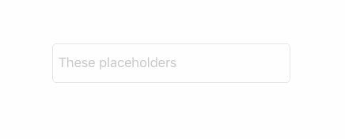

# Placeholders
**Placeholders** gives you the ability to define multiple placeholders for `UITextField`, and also animate their change in the way you like. The result looks like that:



## Usage
#### 1. Define a `Placeholder` object in your view controller:

```swift
let placeholders = Placeholders(placeholders: ["First", "Second", "Third"])
```

If you want to loop placeholders (make the set infinite):

```swift
let placeholders = Placeholders(placeholders: ["First", "Second", "Third"], options: .infinite)
```

If you also want to show them in a random order:

```swift
let placeholders = Placeholders(placeholders: ["First", "Second", "Third"], options: [.infinite, .shuffle])
```

#### 2. In your `viewWillAppear` method, call `.start`:

```swift
placeholders.start(interval: 3.0,
                   fireInitial: true,
                   textField: textField,
                   animation: .pushTransition(.fromBottom))
```

That's it!

## Advanced
**Placeholders** is both easy-to-use and customizable solution. At it's core, `Placeholders` object doesn't know anything about `UITextField`. You can easily use it for other purposes if you wish:

```swift
let placeholders = Placeholders(placeholders: ["A", "B", "C"], options: .infinite)
placeholders.start(interval: 2.0, fireInitial: true, action: { next in
    print(next)
})
```

Actually, all other `UITextField` convenience is just a wrapper around this method.

To define your custom `animation` as, for example, `.pushTransition`, you can extend `UITextField.PlaceholderChange`. Here is, for example, how you can implement your own custom fade animation:

```swift
extension UITextField.PlaceholderChange {
    
    static var fade: UITextField.PlaceholderChange {
        return UITextField.PlaceholderChange { (placeholder, textField) in
            let transition = CATransition()
            transition.duration = 0.35
            transition.timingFunction = CAMediaTimingFunction(name: kCAMediaTimingFunctionEaseInEaseOut)
            transition.type = kCATransitionFade
            textField.subviews.first(where: { $0 is UILabel })?.layer.add(transition, forKey: nil)
            textField.placeholder = placeholder
        }
    }
    
}
```

Or you can use convenience `.caTransition` static function to make your life a bit easier:

```swift
extension UITextField.PlaceholderChange {
    
    static var fade: UITextField.PlaceholderChange {
        return .caTransition {
            let transition = CATransition()
            transition.duration = 0.35
            transition.timingFunction = CAMediaTimingFunction(name: kCAMediaTimingFunctionEaseInEaseOut)
            transition.type = kCATransitionFade
            return transition
        }
    }
    
}
```

And now you can simply write:

```swift
placeholders.start(interval: 3.0,
                   fireInitial: true,
                   textField: textField,
                   animation: .fade)
```

Neat!